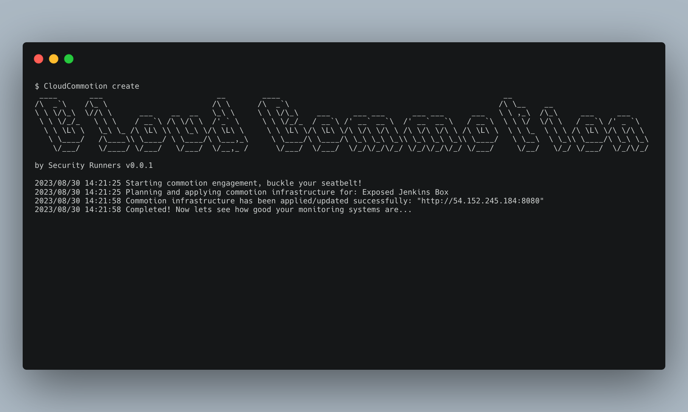

# Cloud Commotion

You can talk the talk, but can you walk the walk? Cloud Commotion is intended to purposefully cause commotion through vulnerable or concerning infrastructure in order to test your alerting systems or lack thereof. It uses terraform to create fictitious scenarios to assess coverage of your security posture allowing you to create, deploy, and destroy the infrastructure with ease. The only question you will need answering is how long will it take for anyone to notice?

<!-- Commenting CLI Image -->
<!--  -->

## Purpose

There is no shortage of breaches as it relates to misconfigured, vulnerable, and overly permissive infrastructure within cloud environments. Cloud Commotion simulates what occurs frequently within the industry to help better prepare you for incidents. We frequently improve on our monitoring systems while seldomly testing the effectiveness and coverage of those systems. This tool intends to create vulnerable, misconfigured, and overly permissive services for a wide variety of scenarios to identify gaps, alerting system for coverage, alert preparedness, and how your team would respond in the event of an incident.

### Inspiration

The scenarios built within the tool are inspired by actual events that occur regularly within the industry. The majority of which go unheard of and stay within the confounds of an organization. Here are just a few publicly available news stories demonstrating how scenarios in Cloud Commotion have occurred within the industry.

- Exposed Jenkins box that lead to ["No Fly List" breach by CommuteAir](https://maia.crimew.gay/posts/how-to-hack-an-airline/)
- Publicly writable S3 bucket for javascript assets leading to [crypto mining on LA Times website](https://www.theregister.com/2018/02/22/la_times_amazon_aws_s3/)
- Publicly [exposed elasticsearch cluster at Amazon's Prime Video](https://techcrunch.com/2022/10/27/amazon-prime-video-server-exposed/)
- Exfiltrated cross account RDS snapshots leading to exposure of [Imperva's customer records](https://krebsonsecurity.com/2019/08/cybersecurity-firm-imperva-discloses-breach/)
- Browserstack backdoor IAM user to [BrowserStack compromised email list](https://web.archive.org/web/20141220062119/http://www.browserstack.com:80/attack-and-downtime-on-9-November)
- Exposed RDS instance lead to the [Drizly breach of 2 million user records](https://techcrunch.com/2020/07/28/drizly-data-breach/)

## About

Cloud Commotion leverages [terraform-exec](https://github.com/hashicorp/terraform-exec) to execute terraform modules to plan, create, and destroy commotion infrastructure. The terraform directory contains all the scenarios to simulate a wide variety of misconfigurations, exposed assets, and concerning infrastructure your team should be alerted on. This tool allows you to create realistic resource names, tags to the resources, and custom variables to align with your organizations current standards. You can of course take these modules and use them within your own deployment tool chain to best simulate a realistic deployment scenario as well. 

## Infrastructure

The infrastructure this tool creates to cause commotion is located within `terraform/` directory to be deployed based upon your configuration. While also allowing you to deploy with your own IaC tooling, using this tool allows you to track and manage the infrastructure associated to it's use. 

### AWS

#### Exposed Services

| Title                      | Description                                                        |
|----------------------------|--------------------------------------------------------------------|
| Public S3 Bucket(Get)      | Creates a public bucket with GetObject operations                  |
| Public S3 Bucket(Get/List) | Creates a public bucket with GetObject and ListBucket operations   |
| Public S3 Bucket(Write)    | Creates a public bucket with PutObject operations                  |
| Public S3 Object(ACL)      | Creates a private bucket with a public object                      |
| Public SQS Queue           | Creates a publicly accessible queue                                |
| Public SNS Topic           | Creates a publicly accessible SNS topic                            |
| Public Secrets Manager     | Creates a publicly acccessible secret                              |
| Public Lambda Invocation   | Creates a lambda function that can be invoked by anyone            |
| Public Lambda Layer        | Creates a labmda layer that is publicly accessible                 |
| Public Lambda Endpoint     | Creates a publicly accessible endpoint for lambda                  |
| Public Glue Policy         | Makes glue resources publicly accessible                           |
| Public Glacier Vault       | Creates a publicly accessible Glacier backup vault                 |
| Public EFS                 | Creates a publicly accessible EFS share                            |
| Public ECR Gallery         | Creates a publicly accessible ECR Gallery registry                 |
| Public ECR                 | Creates a private registry thats publicly accessible               |
| Public AWS Backup Vault    | Creates a publicly accessible AWS Backup Vault                     |
| Public EBS Snapshot        | Creates a public EBS snapshot                                      |
| Public AMI                 | Creates a public server image                                      |
| Public IAM Role            | Creates an IAM role that can be assumed from any AWS account       |
| Public KMS Key             | Creates a public KMS key                                           |
| Public OpenSearch          | Creates a public AWS OpenSearch/ElasticSearch cluster              |

#### Backdoored Assets

| Title                          | Description                                                        |
|--------------------------------|--------------------------------------------------------------------|
| Cross Account EBS Volume       | Creates a EBS Volume shared with another AWS account               |
| Cross Account AMI              | Creates a AMI shared with another AWS account                      |
| Cross Account Role(Admin)      | Creates an administrative IAM role cross account                   |
| Cross Account Role(PrivEsc)    | Creates a privesc IAM role cross account                           |
| IAM User(Console Login)        | Creates an administrative IAM user with console sign in            |
| IAM User(PrivEsc)              | Creates an IAM user vulnerable to priviledge escalation            |

#### Misconfigurations

| Title                      | Description                                                        |
|----------------------------|--------------------------------------------------------------------|
| IAM Role OIDC Takeover     | Creates a IAM role that can be taken over by any GitHub Action     |
| S3 Subdomain Takeover      | Creates a Route53 record that can be taken over through S3         |
| EIP Takeover               | Creates a Route53 record that can be taken over through EC2        |
| Third Party Takeover       | Creates a Route53 record that can be taken over through SaaS       |
| Second Order Takeover      | Creates a static site where a script tag can be taken over         |
| ASG RCE Takeover           | Creates a ASG that can be compromised through S3 takeover          |
| Delegation Takeover        | Creates and deletes a delegated Route53 hosted zone delegated      |

#### Exposed Assets - TODO

| Title                      | Description                                                        |
|----------------------------|--------------------------------------------------------------------|
| Public Jenkins Instance    | Creates a publicly accessible Jenkins instance                     |
| Public Opensearch Instance | Creates a publicly accessible OpenSearch(ElasticSearch) instance   |
| Public SSH Instance        | Creates a publicly accessible SSH instance                         |
| Public AWS Redshift        | Creates a publicly accessible Redshift cluster                     |
| Public RDS                 | Creates a publicly accessible RDS cluster                          |
| Public Lightsail           | Creates a publicly accessible Lightsail instance                   |
| Public EKS Cluster         | Creates a publicly accessible EKS Cluster                          |
| Public ECS Cluster         | Creates a publicly accessible ECS Cluster                          |
| Public Load Balancer(CLB)  | Creates a publicly accessible Classic Load Balancer                |
| Public Load Balancer(NLB)  | Creates a publicly accessible Network Load Balancer                |
| Public Load Balancer(ALB)  | Creates a publicly accessible Application Load Balancer            |
| Public AWS API Gateway     | Creates a publicly accessible API Gateway

#### Ideas

- Backdoors
    - Exposed API Gateway with Administrative Functionality(TODO)
    - Cross Account ECR Policy with Ability to Overwrite Image(TODO)
    - Cross Account Lambda Function with Administrative Permissions(TODO)
    - Exfiltrating Service Snapshots(TODO)
        - AMI
        - RDS(TODO)
        - Redshift(TODO)
- Exposed Assets
    - Exposed Unauthenticated Kubernetes API Actions(TODO)
    - Exposed ECS Cluster(TODO)
    - S3 CloudFront static site sensitive file(TODO)
- Exposed Services
    - Public Elasticsearch/Opensearch(TODO)
- Misconfigurations
    - Plaintext Secrets in a variety of locations(TODO)
        - Instance metadata
        - Environment variables
    - Subdomain takeovers
        - EIP Takeover
        - Public IP Takeover
        - S3 Takeover
        - Third party service takeover
        - Second order subdomain takeover
    - GitHub Actions IAM OIDC takeover
- Destructive
    - Disable Eventbridge notifications(TODO)
    - Disable Security Services(TODO)
    - Ransomware for S3(TODO)

## Usage

Installation/Usage steps go here.

### Variables

These are vaiables that are used across all the scenarios to account for global namespaces, custom flags to alert the responders, and tags to accomodate for tagging strategies. 

- Resource name, for example `piedpiper-static-assets` for `resource_name` variable, to create a ficticios asset that can realistically sit alongside your infrastructure without raising a flag to curious onlookers
- Custom sensitive content, for example `This file was created through cloudcommotion, please report this asset to your security team` for `custom_sensitive_content` variable, to allow for a way for an unsuspecting incident responders to become aware of the drill once identified
- Tags is an optional variable, such as `Creator = cloudcommotion` for `tags` as type `map(string)`, to ensure your asset does not get caught up in unrelated tagging enforcement infrastructure
- Region, such as the default `us-east-1` for `region` variable, to allow you to switch up regions

## Contributing

To contribute to the source code or documentation please feel free to submit an issue, reach out directly, or create a pull request. All requests are appreciated!

### Terraform

Feel free to contribute with any official provider as well as any provider that may be widely adopted. Prior to committing, please generate the readme file as well as ensure proper formatting.

- Create documentation for the module `terraform-docs markdown table . --output-file README.md`
- Format the terraform `terraform fmt .`
- Lint the terraform `tflint`

# Credits

- [breaches.cloud](https://breaches.cloud)
- [Backdoor an AWS Account](https://mystic0x1.github.io/posts/methods-to-backdoor-an-aws-account/)
- [Getting Into AWS Security Research](https://dagrz.com/writing/aws-security/getting-into-aws-security-research/)
